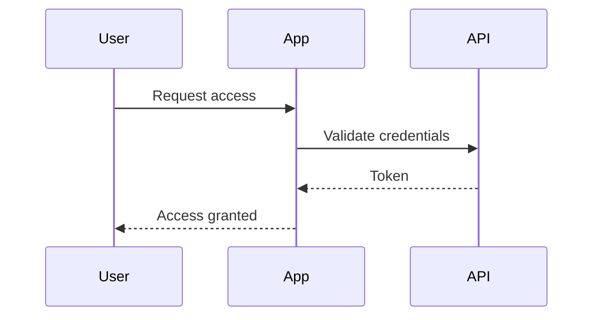

# Colophon — a Quarto Book Scaffold

[](https://github.com/belpub/colophon-quarto/releases/latest)

A production-tested Quarto + LaTeX scaffold for turning Markdown into properly typeset book PDFs — course books, manuals, certification guides, technical handbooks — without hand-fighting LaTeX for every chapter, table, or landscape page.

**Why this exists.** Quarto renders books out of the box, but a handful of real publishing needs — a caption that actually shows up in the List of Tables, a wide table that needs to rotate to landscape without wasting a page, an appendix that numbers itself "Appendix A" instead of "Chapter 11," front/main/back matter that numbers pages correctly across all three — aren't solved by Quarto's defaults, and the fixes aren't always obvious or documented in one place. This toolkit is those fixes, pre-built and tested, so you don't have to rediscover them one broken render at a time.

**What's already handled for you:**

- Front/main/back matter with correct, continuous page numbering (roman → arabic → roman) across the whole book
- A List of Tables/Figures that only appears when there's something to list — no empty, oddly-titled page in a book with no tables
- Figures and tables that render exactly where you place them in the source, not wherever LaTeX's default float algorithm defers them to
- Landscape pages for wide tables, including a landscape-only chapter opener that doesn't waste a page on a bare portrait title first
- Numbered appendices ("Appendix A," "Appendix B," ...) that switch back to numbered chapters or roman-numbered back matter cleanly
- APA citation formatting out of the box, swappable to any other style with one YAML line
- A documented, tested path for diagrams (Mermaid, Graphviz) that avoids a real, confirmed Chrome-dependency trap in Quarto's native PDF rendering path

**Honest scope note:** this has been tested thoroughly against one real, full-length book (70+ pages, multiple parts, landscape appendices, dozens of captioned tables) through repeated, deliberate bug-hunting — not yet against a wide range of community use. If you hit something it doesn't handle, please open an issue; that's exactly how this gets more solid.

## Who this is for
You're a good fit for this toolkit if:
- You're writing a book-length document — a course book, training manual, certification guide, internal handbook, technical reference — not a single article or a slide deck.
- You want the finished result to look genuinely professionally typeset — proper front/back matter, working cross-references, a real List of Tables — without hand-coding LaTeX yourself.
- You're comfortable writing in plain Markdown (or willing to learn it — it's a lot smaller than it sounds) but don't want to become a LaTeX expert just to produce a clean PDF.
- You'd rather start from something that's already hit and fixed the sharp edges than discover them yourself three chapters in.

You're probably *not* the target user if you need a single one-off document (a normal Quarto or Pandoc setup is simpler for that), or if your primary output is a website/HTML rather than a printed or PDF book — this toolkit's value is almost entirely in the PDF/print-specific typesetting problems it solves.

**No LaTeX knowledge required to use it day to day.** You write Markdown; the toolkit's `preamble.tex` and `brand.tex` do the LaTeX work invisibly underneath. You'll only ever touch raw LaTeX directly for the handful of things Markdown genuinely can't express on its own (a captioned table, a landscape page) — and those are documented with working, copy-pasteable examples, not left for you to invent.

New to this project? Start with [**`docs/BOOK-CREATION-GUIDE.md`**](https://github.com/belpub/colophon-quarto/blob/main/docs/BOOK-CREATION-GUIDE.md) — it covers installing Quarto, VS Code, and TinyTeX from scratch, then walks through every day-to-day task (adding a chapter, tables, citations, branding). This README is the deeper reference underneath that guide: the *why* behind this scaffold's less obvious design choices, for whoever ends up maintaining or extending it.

## What this is
This is a brand-agnostic starting point for producing book-style PDFs (course books, manuals, handbooks) with Quarto + LaTeX. It renders out of the box with **zero setup** — no fonts to source, no logo required, generic placeholder colors — so you can confirm the whole pipeline works before customizing anything. Adapting it to a real brand is a small, contained edit (see "Making this your own" below), not a rewrite.

## Before you render
One-time setup: `quarto install tinytex` (see [`docs/BOOK-CREATION-GUIDE.md`](https://github.com/belpub/colophon-quarto/blob/main/docs/BOOK-CREATION-GUIDE.md) for full installation steps if this is
a new machine). That's it — this toolkit ships with everything else it needs.

## Rendering
    quarto render

## Live preview while writing
    quarto preview

## Making this your own — brand.tex and title-page-content.tex
Two files hold everything specific to *your* book; nothing else in the project should need to change:

- **`brand.tex`** — colors, fonts, and the running-header book title. Ships with generic placeholder colors and two freely-licensed fonts (TeX Gyre Termes for body, TeX Gyre Heros for headings) that come bundled with every standard TeX install — no font files to source just to get started. When you have real brand fonts, replace the two font blocks with the `Path=fonts/` pattern that's commented in-line in `brand.tex` (put the actual static-weight `.ttf` files in a `fonts/` folder first — variable-font files don't work reliably with LaTeX's font engine, and the font family name you pass to `\setmainfont`/`\newfontfamily` needs to exactly match your files' basename, e.g. family `YourFont` needs files named `YourFont-Regular.ttf`, not `Your Font-Regular.ttf` — a mismatch here is a real, easy-to-hit render error).
- **`title-page-content.tex`** — the actual words on the title page (title, subtitle, tagline, which logo file to use). Placeholder text throughout, ready to replace.
- **`logo-placeholder.png`** is a generic stand-in so the title page renders correctly out of the box. Replace it with a real logo file and update the filename in `title-page-content.tex` to match.

Everything else — `preamble.tex` (the structural engine: page layout, table mechanics, front/back-matter page numbering, landscape handling) — is brand-agnostic by design and shouldn't need to change. See "Front matter / main matter architecture" below for why that separation matters and what happens if the two get mixed back together.

## Editing
- Write chapter prose in Typora or VS Code — plain Markdown.
- Add new chapters: create a .qmd file, add its filename to the `chapters:` list in _quarto.yml.
- chapter-01.qmd includes a working example of a landscape wide table with brand-colored header/first-column shading and proportional (not equal-width) columns.
- chapter-02.qmd includes a working example of a manual page break.

## Em dashes and en dashes in headings
Chapter titles and section headings render em dashes (—) and en dashes (–) correctly out of the box — but this took a real fix to get right, worth knowing about if you ever add a new custom font. `\setmainfont` (the body text font) gets fontspec's `Mapping=tex-text` font feature automatically, which is what converts LaTeX's `---`/`--` dash conventions into real em/en-dash glyphs. `\newfontfamily` (used for `\headingfont`, the font chapter and section titles are set in) does **not** get this automatically — without it, a heading with an em dash in the source renders as a literal `---` on the page, even though body text with the exact same character renders correctly right below it. Both toolkits' `brand.tex` explicitly add `Mapping = tex-text` to the `\newfontfamily\headingfont{...}` definition to fix this — confirmed this applies the same way regardless of whether the heading font is loaded from local files or as a system font (this toolkit's default, TeX Gyre Heros, uses the latter). If you ever swap in a different heading font, keep that option in the new font's own `\newfontfamily` block — dropping it silently reintroduces this exact bug.

## Long chapter titles wrapping to two lines
`\titleformat{\chapter}` in `preamble.tex` sets `\raggedright` on the title text — needed to fix a real, confirmed defect, not a preemptive safeguard. A long chapter title that wraps to a second line otherwise gets fully *justified* at `\Huge` size, which is LaTeX's normal paragraph default — but stretching a handful of huge words to exactly fill a line's width produces visibly uneven, overly wide gaps between them on the wrapped line, worse the fewer words that line has. Reproduced directly with a real long title ("Dissecting Twelve Unique Security Failures and Governance Layers Across a Decade") and confirmed `\raggedright` fixes it cleanly, with zero effect on short, single-line titles — nothing to configure per chapter either way. Parts don't need the same fix: `\titleformat{\part}` already uses `\centering`, which doesn't stretch inter-word spacing the way justification does, so a long two-line part title was never affected by this.

## Colors
Generic placeholders, ready to replace in `brand.tex`:

| Color | Hex | Used for |
|---|---|---|
| Primary (`giPrimary`) | `#1E3A5F` | Headings, primary UI |
| Secondary (`giSecondary`) | `#4A4A68` | Secondary accents, subsections |
| Accent (`giCrimson`) | `#A6303F` | Core accent — titles, rules. Also doubles as the risk-table "danger" color. |
| Ink (`giInk`) | `#1A1A1A` | Body text |

Plus supporting tints/neutrals (warning, success, accent link color, grays) — all defined in `brand.tex`, all placeholders.

## Logo
`logo-placeholder.png` is a generic stand-in, referenced from `title-page-content.tex` (not hardcoded into the title page layout itself — see "Making this your own" above). See "Logo usage" further down for guidance on replacing it and sizing a real logo correctly.

## Known ordering fix (already applied)
Quarto's `toc: true` auto-inserts the Table of Contents at a fixed template location that lands *before* a custom title page. This scaffold disables that (`toc: false`) and places the TOC manually via `contents.qmd`, positioned correctly after Preface and before the Introduction. If you ever re-enable `toc: true`, this will break again — leave it as `false`.

## Front matter / main matter architecture (read before editing)
This scaffold's page-numbering and chapter-numbering correctness depends on a few non-obvious things Quarto's book template does under the hood. If you restructure the front matter, keep these in mind:

1. **The title page lives in `title-page.tex`, not in a `.qmd` file**, and is pulled in via `include-before-body`. Any raw LaTeX content placed *before* a Markdown heading inside a `.qmd` chapter file gets silently reordered by Quarto to *after* that heading in the rendered output — so a title page written inside `index.qmd` above a heading does not render first. Putting it in `include-before-body` guarantees it's the literal first thing in the document, with no `\chapter` wrapper (which would otherwise force an extra blank page ahead of it).
2. **`index.qmd` is required by Quarto** as the book's home page and must appear first in `book: chapters:` — this can't be removed. Rather than waste that mandatory slot on a blank page, it doubles as the Copyright page here.
3. **Quarto/Pandoc's book template unconditionally inserts its own `\mainmatter`** immediately before your `chapters:` content begins (i.e. right before Copyright), regardless of any `\frontmatter`/ `\mainmatter` you write yourself. Left alone, this silently forces arabic page numbers on Copyright/Preface/TOC. `preamble.tex` neutralizes that one automatic call and exposes `\giEnableMainMatter` instead — fired exactly once, at the end of `contents.qmd`, right before the Introduction chapter. Don't add your own raw `\mainmatter` elsewhere; use `\giEnableMainMatter` at the one spot main matter should actually begin.
4. **A `.qmd` chapter file with no heading at all gets auto-wrapped in a numbered `\chapter{}`** by Quarto (a stray, visible "Chapter N" on a blank page). Give any heading-less content an `{.unnumbered .unlisted}` heading instead (see `contents.qmd`).
5. **`\tableofcontents` prints its own internal chapter heading.** Pairing it with your own Markdown heading produces two chapter-openings in a row (an extra blank page). `contents.qmd` uses `\@starttoc{toc}` instead — it renders only the entries, under the Markdown heading you control.
6. **Any raw LaTeX command that forces its own page break (`\frontmatter`, `\mainmatter`, `\backmatter`, `\cleardoublepage`, etc.) must execute *before* the next chapter's heading, never after** — otherwise the reordering behavior in point 1 will insert the break in the middle of that chapter (heading on one page, body text pushed to the next). The fix is always the same: put the command at the very end of the *previous* file, not the top of the next one. See `\backmatter` at the end of `chapter-02.qmd`.

## Parts (grouping chapters under Part I, Part II, ...)
Neither toolkit uses Parts by default — the example content is a flat chapter list — but Quarto's native support for them works cleanly with everything else in this scaffold, verified by actually building a Parts-based version and checking the numbering, TOC, and headers, not just reading Quarto's docs. Add a Part with a `part:` entry in `_quarto.yml`'s `chapters:` list:

```yaml
book:
  chapters:
    - index.qmd
    - preface.qmd
    - contents.qmd
    - introduction.qmd
    - part: part-one.qmd       # a file containing just `# Part Title`
      chapters:
        - chapter-01.qmd
        - chapter-02.qmd
    - part: part-two.qmd
      chapters:
        - chapter-03.qmd
    - references.qmd
    - closing.qmd
```

Each `part:` value is a `.qmd` file, typically just a level-one Markdown heading (`# Part One: Foundations`) — that heading text becomes the part title. A short overview paragraph right after the heading works too (see the next bullet below) — it isn't limited to heading-only files. (Quarto also accepts a quoted string directly in the YAML instead of a file — `part: "Part One: Foundations"` — but a file is the more common pattern and what's documented/tested here.)

What to expect, confirmed by an actual test render:
- **Part numbering is automatic** — "Part I," "Part II" — and styled to match the rest of the book via the `\titleformat{\part}` block in `preamble.tex` (crimson label, navy title, crimson rule, centered — the same visual language as chapter openings, just larger and on its own divider page). This styling is completely inert if you never use `part:` — safe to leave in place either way.
- **A part-overview paragraph lands on the same page as the title, not a separate one.** Standard LaTeX book class always forces a fresh page immediately after a Part title, even with nothing else on it — the classic print convention of a Part as its own bare "divider" page. That's not what most people expect from a short intro paragraph placed right after a `# Part Title` heading, so `preamble.tex` overrides it: `\titleclass{\part}{top}` (right before the `\titleformat{\part}` block) reclassifies `\part` from titlesec's default "page" class to "top" — the same class `\chapter` uses — which keeps the title starting its own fresh page but stops it from *also* forcing whatever comes after onto a separate page. Note this had to be titlesec's own `\titleclass` mechanism specifically: titlesec fully replaces LaTeX's `\part` command internally, so the kernel-level fix (redefining `\@endpart`, the traditional way to control this) silently does nothing once titlesec is loaded — worth knowing if you ever go looking at how this works. A heading-only part file is unaffected either way — its first chapter still starts its own fresh page regardless, since `\chapter` forces that independently of `\part`.
- **Chapter numbers are NOT reset per part** — they continue counting straight through the whole book (Chapter 1, 2, 3... regardless of which part they're in), which is the standard convention for most books. `\thepart` defaults to roman numerals; switch to `\arabic{part}` in the `\titleformat{\part}` block in `preamble.tex` if you want "Part 1, Part 2" instead.
- **Table of Contents nests correctly automatically** — Part entries appear bold and prominent, with their chapters indented underneath, no extra work needed.
- **Running headers are unaffected** — inside a chapter's pages, the header still correctly shows that chapter's name (via `\leftmark`), not the part name.
- **Every other custom mechanism in this scaffold — front/back matter page numbering, the List of Tables/Figures chapters-only gate, landscape pages, citations — is unaffected.** Parts sit at a structural level Quarto handles independently of all of it.

## Header / footer
- Chapter-opening pages show no header — just a page number in the footer — since the large chapter title on that page already states where you are. Only continuation pages get the running header.
- The running header shows one item at a time, alternating by page: the current chapter name on odd pages, the book title (`\giBookTitle` in `brand.tex`) on even pages. This is deliberate — putting both on the same line risks collision or an ugly wrap if either title is long. The header box wraps to a second line gracefully for long titles rather than overflowing.
- Landscape pages don't use the running header/footer at all. `pdflscape` rotates the *body* content of a `landscape` block, but has no effect on `\fancyhead`/`\fancyfoot`, which draw against the physical (portrait) page edges — so on a landscape page they'd render sideways in the margin. Instead, `\giLandscapeHeader` / `\giLandscapeFooter` (in `preamble.tex`) print a matching header/ footer line as ordinary content *inside* the `landscape` block, so it's part of the same rotated box as the table and reads normally horizontal. `\giLandscapeFooter` uses `\vfill` to anchor the page number to the physical bottom of the page regardless of how much content the table takes up — always call `\giLandscapeHeader` right after `\begin{landscape}` and `\giLandscapeFooter` right before `\end{landscape}` — see `chapter-01.qmd`.

## A chapter whose only content is a landscape table or figure
Use `\giLandscapeChapterOpener{Title}` and `\giLandscapeChapterHeader` (both in `preamble.tex`) instead of a normal Markdown heading and `\giLandscapeHeader` — see the working example in `chapter-01.qmd` if one's present in this project, or build one following the pattern below.

The problem this solves: a normal Markdown `# Heading` always produces a full portrait page (the chapter title, styled large, on its own page) before any content follows. That's the right behavior when real portrait content follows the title on the same page — but if a chapter's first (or only) content is a landscape table/figure, the portrait title page ends up nearly blank (title only — nothing else fits before the landscape rotation needs its own page), and the actual content only starts on the page *after* that. Confirmed and fixed by testing a chapter whose entire content was one landscape table: the wasted page is gone, and the chapter title now appears horizontally, as part of the landscape page's own header, right above the table.

Usage — raw LaTeX, not a Markdown heading, since the whole point is to skip the normal heading-driven title page. In your `.qmd` file's chapter content, this replaces the normal `# Heading`:

```latex
\giLandscapeChapterOpener{A Chapter That Is Only A Landscape Table}
\begin{landscape}
\giLandscapeChapterHeader

... table or figure, exactly as in a normal landscape block ...

\giLandscapeFooter
\end{landscape}
```

(Wrap the block above in a ```` ```{=latex} ````/```` ``` ```` raw LaTeX fence in the actual `.qmd` file, the same as any other raw LaTeX content in this project.)

`\giLandscapeChapterOpener{Title}` does the same bookkeeping a normal chapter heading does — advances the chapter counter, adds the Table of Contents entry, sets the running header text for later pages — just without typesetting a separate portrait title page. `\giLandscapeChapterHeader` (no arguments — it reuses the title `\giLandscapeChapterOpener` already stored) shows "Chapter N: Title" horizontally at the top of the landscape page itself, in place of the normal `\giLandscapeHeader`.

**If the chapter has any portrait content before the landscape block — even one paragraph — use a normal Markdown heading and `\giLandscapeHeader` instead**, exactly as documented above; this pair is specifically for the landscape-content-only case.

This surfaced a real, separate bug worth knowing about, already fixed as part of building this: a chapter `.qmd` file with no Markdown heading at all (true here, since the opener replaces the heading with raw LaTeX) makes Quarto auto-insert an empty `\chapter{}` of its own — the book project model expects every chapter file to correspond to some heading, and falls back to a blank one when it finds none. Left alone, that produced an even worse version of the original problem (a second, completely blank "Chapter N" page, consuming a chapter number `\giLandscapeChapterOpener`'s own numbering then had to increment past). Chasing that down surfaced a second, more fundamental bug in the fix itself, corrected in the same pass: naively redefining `\chapter` to ignore an empty title broke every *starred* chapter call in the whole project (`\chapter*{Copyright}`, `\chapter*{Preface}`, `\chapter*{Introduction}`, etc.) — LaTeX's undelimited-argument grabbing took the literal `*` character as the "title" for each of those, which is non-empty, so they silently fell through to an *unstarred*, numbered chapter call instead. The corrected version in `preamble.tex` uses proper `\@ifstar`-based dispatch: a starred call goes straight through to the real `\chapter*` untouched, and the empty-title check only ever applies to the plain, unstarred form Quarto's auto-inserted wrapper actually uses.

## Table styling
- Tables render left-aligned (flush with body text), not centered — `\LTleft`/`\LTright` in `preamble.tex` override `longtable`'s default centering behavior for every table in the book, Pandoc-generated or raw.
- Column widths in raw-LaTeX tables are weighted by expected content length, not equal — Pandoc's auto-generated Markdown tables always split width equally across columns, which wastes space on short columns and forces long-text columns to wrap onto extra lines instead of using the room available. The `chapter-01.qmd` example weights each `p{}` column width (`\real{0.09}`, `\real{0.28}`, etc. — the eight values sum to 1.0) based on how much text each column typically holds, not its header text. When you add a table with very different column content, adjust these weights to match; there's no formula, just eyeball roughly how wide each column's *typical* content needs to be.
- Three brand shading colors are defined in `brand.tex`: `giTableHeaderShade` (header row), `giTableFirstColShade` (first column), `giTableAltRowShade` (alternating body rows — defined but unused by default, see below), and `giTableDivider` (hairline row rules). Pandoc's Markdown-table output can't target the header row or a single column — only whole-row striping via `\rowcolors`. For header/ column-level shading, write the table as raw LaTeX and combine `\rowcolor` (whole row) with `\cellcolor` (single cell, overrides the row color) — see the worked example in `chapter-01.qmd`.
- That example uses hairline dividers between rows instead of alternating (zebra) row shading. Zebra striping plus rules on the same table tends to compete visually — two separate row-separation techniques doing the same job — and reads as busier/less clean than picking one. Dividers plus the header/first-column shading is the current recommendation; `giTableAltRowShade` is still defined if you'd rather swap back to zebra striping for a given table (just use `\rowcolor{giTableAltRowShade}` on alternating rows instead of `\arrayrulecolor{giTableDivider}\hline` between them).

## Back matter
`closing.qmd` holds unnumbered back-matter pages (institute bio, thank-you) after the last numbered chapter. Add more the same way — new `{.unnumbered}` headings in that file, or new files appended to `chapters:` after it. Call `\giEnableBackMatter` at the true end of the last numbered chapter (see `chapter-02.qmd`) — same "must fire before the next heading, not after" rule as `\giEnableMainMatter`. It switches page numbering back to roman, *continuing* from where front matter left off (front matter ends at "iii" → back matter starts at "iv") rather than restarting at "i" — this keeps every page label in the document unique, which matters if anyone ever needs to cite or reference a specific page. That continuation point is captured by `\giMarkFrontMatterEnd`, called at the end of `contents.qmd` right before `\giEnableMainMatter` — if you add or remove front-matter pages, that's automatic; you don't need to hand-count anything.

## Known limitation
Per-row \rowcolor commands (e.g. to shade just the header row a different color than the body) don't work with Pandoc's. auto-generated Markdown tables — only with hand-written raw LaTeX tables. The current setup zebra-stripes the body rows and leaves the header distinguished by its border rule, which covers most needs. If a specific table needs a truly shaded header, that one table would need to be written as raw LaTeX instead of a Markdown table (see `chapter-01.qmd` for a full worked example with header, first-column, and alternating-row shading combined).

## Logo usage
`logo-placeholder.png` (500×150) is a generic placeholder, sized to match a typical horizontal logo lockup. Once you have a real logo:

- If it's a wide/horizontal lockup, replace `logo-placeholder.png` directly (same dimensions) and update the filename in `title-page-content.tex` if you rename the file.
- If your real logo is square or vertical instead, that's fine too — just update `\giTitlePageLogoWidth` in `title-page-content.tex` to a width that reads well at that aspect ratio (a square logo usually wants a narrower width than a wide horizontal one).
- If you have multiple logo variants (horizontal + square/icon-only, say), use the horizontal one for the large title-page placement, and reserve the square/icon one for anywhere small — a running-header mark, favicon-style badge, certificate seal — where a wide lockup's fine print would blur out at small size.

Whatever you use, check its resolution against how large it renders: a 500px-wide file at the current title-page size (`0.42\textwidth` on an A4 page) renders around 175–180 DPI — fine for on-screen PDF viewing, not for print. If this book ever needs to be printed, or the logo needs to render larger, get a vector version (SVG/EPS/PDF) or a much higher-resolution raster (1500–2000px+) instead, so it scales cleanly to any size used across the book.

## Captions, alt text, and the Lists of Tables/Figures

**The short version, if you just want the two correct patterns:**

A captioned table (raw LaTeX, always — see why below):
```latex
\begin{longtable}[]{@{}
  >{\raggedright\arraybackslash}p{0.3\linewidth}
  >{\raggedright\arraybackslash}p{0.6\linewidth}
@{}}
\toprule
\textbf{Term} & \textbf{Definition} \\
\midrule
\endhead
Asset & Something of value \\
\bottomrule
\caption{\label{tbl-terms}Definitions used throughout this chapter.}
\end{longtable}
```

A captioned figure (plain Markdown, no raw LaTeX needed):
```markdown
{#fig-terms width="60%" fig-alt="A diagram showing how the four key terms relate to one another."}
```

Both of those, written exactly like that, will render correctly on the page **and** show up correctly in the List of Tables/Figures, with working `@tbl-terms`/`@fig-terms` cross-references. The rest of this section explains the two things people most often trip up on: the difference between a *caption* and *alt text*, and why tables and figures need different syntax in the first place.

### Caption vs. alt text — these are two different things
- **Caption** — the visible text printed under the table/figure on the page, and the exact text that shows up as the entry in the List of Tables/Figures. For a table, this is whatever's inside `\caption{...}`. For a figure, this is the text inside the square brackets: ``.
- **Alt text** — a separate, *invisible* description for accessibility (screen readers, PDF accessibility tools) — it never
  prints on the page and never appears in the List of Figures. For a figure, this is the optional `fig-alt="..."` attribute. **Tables don't have a separate alt-text attribute in this toolkit** — a table's accessible description is just its caption; there's no raw-LaTeX equivalent of `fig-alt` for a `longtable`.

Confusing the two is the single most common mistake here — writing a long accessibility description as the caption (so it prints as awkwardly long text under the image) or a caption as the alt text (so it never shows up in the List of Figures, since the List only ever reads the *caption*, not `fig-alt`). The caption should be short — what you'd want to see if you were scanning the List of Figures — while `fig-alt` can be longer and more literally descriptive, since a screen-reader user only ever hears it once, in place of seeing the image itself.

A figure with both, correctly separated:
```markdown
{#fig-model
fig-alt="The illustration depicts the inside-out trust model,
featuring four central components in Layer 0 at its core, encircled
by Layers 1 to 3, with the six governance layers forming the
outermost perimeter."}
```
The bracketed text is short and scannable — exactly what you'd want in the List of Figures. `fig-alt` is longer and more literal, since its only job is standing in for the image for someone who can't see it.

### Tables — raw LaTeX, always, for a caption
- A *table header* — the bold label right above a table, like "Sample requirements register" in `chapter-01.qmd` — is just an ordinary bold Markdown paragraph. No special syntax; works the same above a Markdown table or a raw-LaTeX one, and is unrelated to the caption itself (a table can have a header, a caption, both, or neither).
- *Captions* need raw LaTeX, always. Pandoc's native Markdown table caption syntax (a `:` line after the table) hardcodes the caption **above** the table with no way to move it. To get a caption below the table, write the table as raw LaTeX and place `\caption{}\label{}` near the end, right before `\end{longtable}` — see either table in `chapter-01.qmd` for the pattern. Do **not** wrap a captioned table in `\def\LTcaptype{none}` — that's Pandoc's own convention for suppressing numbering on *uncaptioned* tables; leaving it on a captioned table stops it from numbering and keeps it out of the List of Tables.
- Citations don't resolve inside a raw LaTeX block — Quarto's citation processor only sees actual Markdown text, not content inside `` ```{=latex} `` fences. Keep any `@citekey` in the prose around the table, not inside `\caption{}` itself.
- Label raw-LaTeX tables `\label{tbl-yourname}` — the `tbl-` prefix matters. With it, Quarto's crossref system treats the table like any native one, so `@tbl-yourname` elsewhere in the text auto-resolves to "Table 2.1" (or whatever it ends up numbered), and stays correct if tables get added/reordered later — see `@tbl-terms`/`@tbl-controls` in `chapter-01.qmd` for a working example. Without the `tbl-` prefix (e.g. a plain `\label{tab:x}`),
  rendering still works fine, but you'll see a `quarto render` warning like "Raw LaTeX table found with non-tbl label" — harmless to leave (the PDF still builds correctly, the table just isn't reachable via `@key` cross-references), but the `tbl-` prefix is free to add and worth doing from the start.
- The List of Tables sits right after the Table of Contents in `contents.qmd`, using the same `\@starttoc` pattern that placed the TOC itself (`\@starttoc{lot}` instead of `\@starttoc{toc}` — see the comments there for why `\listoftables` isn't used directly). It fills in automatically from every properly-captioned table in the book, in reading order, no manual maintenance needed. **A table with no `\caption{}` at all never appears here** — that's normal and expected for an uncaptioned reference table you don't want listed, not a bug.

### Figures — plain Markdown, no raw LaTeX needed
- Figures are simpler than tables here — plain Markdown image syntax works, and the caption prints **below** the image by default (Pandoc's normal behavior for figures — no override required the way tables needed one):
  ```markdown
  {#fig-yourname width="40%"}
  ```
- Same `fig-` labeling convention as tables' `tbl-` prefix — it's what makes `@fig-yourname` resolve elsewhere in the text to "Figure 3.1" (or whatever it's numbered) and enters it into the List of Figures. See `@fig-logo` in `chapter-02.qmd` for a working example. **The `#fig-yourname` label is what makes an image count as a captioned figure at all** — an image with no label and no bracketed caption text renders as a plain, uncaptioned picture, same as an uncaptioned table: correct if that's what you want, invisible to the List of Figures if not.
- The List of Figures sits right after the List of Tables in `contents.qmd`, same `\@starttoc{lof}` pattern as the other two.
- **List of Figures (and List of Tables) is chapters-only — enforced automatically, not just by convention.** Pandoc treats any standalone Markdown image with alt text as a captioned figure by default, so a completely ordinary-looking image in a front- or back-matter file (a logo on an "About" page, say) would otherwise silently end up in the List of Figures too — this actually happened during development, from a perfectly normal `` image, not a mistake. `preamble.tex`'s "LIST OF FIGURES / LIST OF TABLES — CHAPTERS ONLY" section fixes this at the mechanism level: front- and back-matter files can caption images and tables freely, and they're automatically kept out of both lists — nothing to remember or avoid. (One small cosmetic side effect: a captioned figure/table outside a chapter still shows a numbered "Figure N.N:"/"Table N.N:" prefix on the page itself, since LaTeX's figure/table counters are a single global sequence that doesn't reset between front/main/back matter — just not listed. If that number is undesirable on a specific page, omitting the caption entirely, as before, remains a valid option — see `closing.qmd` for a working captioned example.)

## Figure placement (drifting away from its source position)
Fixed and verified against a real reported case, not just a synthetic test. `_quarto.yml` sets `fig-pos: "H"`, which forces every figure to render exactly where it appears in the source instead of LaTeX's default floating behavior.

This needed correcting once already, worth recording so the mistake doesn't get repeated: an earlier version of this note claimed `[H]` placement was already Quarto's default in this setup, "confirmed by inspecting the generated `.tex`." That conclusion was wrong — it came from checking only the first few figures in a longer test document, which happened to have `[H]`, without checking all of them. A real user report with their actual chapter content (a technical book chapter with a diagram placed right after a subheading) showed the figure landing two subsections later, splitting a sentence across a page break. Re-tested properly this time — every figure in an 8-image stress test, not just the first few — and confirmed Quarto does **not** add `[H]` by default: figures use bare `\begin{figure}`, subject to normal LaTeX float-queueing, which can legitimately drift a figure many paragraphs (even sections) from where it's written. `fig-pos: "H"` is what actually closes this, confirmed by re-running the exact reported case and watching the figure land back in the correct position, immediately below its intended subheading.

One attempted *additional* safety net — automatic `\FloatBarrier` insertion at every chapter/section boundary via
`\usepackage[section]{placeins}`, on top of `[H]` — was tried, found to actively corrupt chapter titles (titlesec, which this project uses for chapter/section styling, fully replaces LaTeX's own sectioning commands, and `placeins`'s automatic hook into `\chapter` isn't compatible with that), and was reverted rather than shipped. Not in this project; don't reintroduce it without solving that incompatibility first. `fig-pos: "H"` alone has been sufficient in every case tested.

## Diagrams (Mermaid, Graphviz, and other tools)
Quarto has native, built-in support for both Mermaid and Graphviz — a `` ```{mermaid} `` or `` ```{dot} `` fenced code block right in your `.qmd` file, no external tool needed to write the diagram syntax. **This toolkit deliberately doesn't use that native support for PDF output — use it for HTML if you ever build that, but not here.** Verified directly, not assumed from documentation: rendering either a Mermaid or a Graphviz code block to PDF requires a headless Chrome/Chromium install, and that dependency is genuinely fragile — confirmed hitting it directly (`quarto install chromium` failed in one real environment due to network restrictions), and it matches a long, still-active trail of upstream bugs specific to PDF output — diagrams cropped, renders that hang indefinitely, failures specific to having more than one diagram in a document. HTML output doesn't have these problems; PDF does. For a book/course-material toolkit where PDF is the actual deliverable, that's not a dependency worth carrying.

**The reliable pattern instead: generate the diagram externally, export to PNG, embed it as a normal figure** — the same figure pipeline already used and proven everywhere else in this toolkit (correct placement via `fig-pos: "H"`, correct captioning, correct chapters-only List of Figures behavior). Confirmed working end-to-end: generated a diagram with `dot`, embedded the PNG with plain Markdown image syntax, rendered clean with correct numbering and placement.

```markdown
{#fig-review width="70%"}
```

**Export to PNG, not SVG.** Also confirmed directly: LaTeX can't embed SVG without an Inkscape conversion step this toolkit doesn't install — an SVG image reference fails the render outright. PNG works natively with `\includegraphics`, no extra dependency.

### Graphviz — recommended for flowcharts, hierarchies, dependency graphs
Best for anything that's fundamentally nodes-and-edges without a time/sequence dimension: process flows, org charts, decision trees, architecture diagrams, dependency graphs. Mature (decades-old, extremely stable), free, open source, and — unlike Mermaid — needs no browser dependency at all for local generation, since `dot` renders directly to an image file:

```bash
dot -Tpng diagram.dot -o diagram.png
```

A working example, matching the style used elsewhere in this project (rounded boxes, left-to-right flow — more compact for a book page than the default top-to-bottom):


**Tips:**
- `rankdir=LR` (left-to-right) usually fits a portrait book page better than the default top-to-bottom layout, which gets tall fast.
- Set `fontname` to something close to the book's body font (e.g. `"Helvetica"` or `"Arial"`) — Graphviz's default font looks noticeably different from everything else on the page otherwise.
- Keep diagrams narrow rather than wide — a graph much wider than it is tall will get shrunk hard by `width=` to fit the text column, making labels tiny. If a diagram is naturally wide, consider a landscape page (see "A chapter whose only content is a landscape table or figure" above) instead of shrinking it to fit portrait.
- Graphviz is installed by default on most Linux distributions and available via `apt install graphviz` / `brew install graphviz` / the official Windows installer — check with `dot -V` before assuming it's missing.

### Mermaid — recommended for sequence diagrams, gantt charts, state diagrams
Best for anything with a time or process-flow dimension Graphviz doesn't represent naturally: sequence diagrams (who calls whom, in what order), gantt charts, state machines, user journey maps, entity-relationship diagrams. The Mermaid *library* — the free, open-source, MIT-licensed diagramming syntax Quarto embeds — is **not** the same thing as "Mermaid Chart," a separate paid hosted editor product from the same team. Nothing in this toolkit's recommended workflow touches that paid product; both the syntax and the rendering tooling below are free.

Two ways to generate a PNG:
- **[mermaid.live](https://mermaid.live)** — free web editor, paste the diagram syntax, export PNG directly. No install, good for a
  one-off diagram.
- **`mermaid-cli`** (the `@mermaid-js/mermaid-cli` npm package) — for a scriptable, repeatable pipeline if you're generating many diagrams or want them regenerated automatically when the source changes: `npm install -g @mermaid-js/mermaid-cli`, then `mmdc -i diagram.mmd -o diagram.png`.

A working example:



**Tips:**
- Export at 2x or 3x scale (`mmdc -i diagram.mmd -o diagram.png -s 3`) for print-quality resolution — the default export resolution is tuned for screens, and looks visibly soft printed at book page size.
- Match Mermaid's theme colors to the brand palette in `brand.tex` where practical (Mermaid supports a `%%{init: {'theme': ...}}%%` directive, or full custom theming via `themeVariables`) — a diagram in Mermaid's default blue/purple next to brand-navy text reads as visibly off-brand.
- Keep one diagram type consistent across a whole book/course where possible (e.g., always Graphviz for architecture diagrams, always Mermaid for process sequences) — mixing styles for the same kind of content within one book looks inconsistent to a reader even when each individual diagram is fine on its own.

### General workflow, both tools
- Keep the diagram source files (`.dot`/`.mmd`) in the project alongside the generated PNGs — a `figures/` or `diagrams/` folder is a reasonable convention — so a diagram can be edited and regenerated later rather than only existing as a flattened image.
- Use `#fig-` prefixed labels on the embedded image, exactly as any other figure, so `@fig-yourname` cross-referencing works and it's correctly counted for the List of Figures — see "Figures and the List of Figures" above.
- If a diagram needs to be wide rather than tall, a landscape page (or, if it's the only thing in its chapter, the landscape chapter opener above) fits it better than shrinking it into a portrait column.

## A book with no tables, or no figures
Both the List of Tables and List of Figures disappear entirely — heading, page, everything — when there's nothing to put in them, so a book without any tables (or without any figures) doesn't end up with an empty, oddly-titled page. This is handled automatically by `\giOptionalTOCList` in `preamble.tex`, called for each list in `contents.qmd`; nothing to configure per book. The two lists are controlled independently — a book with tables but no figures gets a List of Tables and no List of Figures page, and vice versa.

## The Introduction's chapter number
`introduction.qmd`'s heading is `# Introduction {.unnumbered}` by default — it appears in the Table of Contents and still starts page numbering at 1, but doesn't consume "Chapter 1"; your first real chapter becomes Chapter 1. This matches how most books handle their introduction. If you'd rather have the Introduction itself *be* Chapter 1 (some books do it that way), just remove `{.unnumbered}` from that heading — nothing else needs to change; every chapter after it renumbers itself automatically either way.

## Citation style
This toolkit ships with **APA 7th edition** as its default — set via `csl: apa.csl` in `_quarto.yml`. The `apa.csl` file (fetched from the official [citation-style-language/styles](https://github.com/citation-style-language/styles) project, the same source Zotero pulls from) sits in the project root alongside `references.bib`.

Why APA as the starting default: it's the most widely recognized citation convention for professional/practitioner-oriented content (business, leadership, technical training) — a reasonable default for most course books built on this toolkit — as opposed to Chicago (more common in humanities/publishing) or IEEE (specific to engineering/CS journals). Confirmed working by rendering and checking the actual output, not just assumed from the config: in-text citations use "&" between authors and the reference list follows APA's author-date structure (`Author, A. A., & Author, B. B. (Year). Title. Source.`), both correct APA 7 conventions.

**To use a different style** (a specific brand or course might want its own house style): download the matching `.csl` file from the [Zotero Style Repository](https://www.zotero.org/styles) (search by name — "Chicago," "IEEE," "Vancouver," etc. — and download the "in-text" or "author-date" variant, not "note," unless footnote-style citations are specifically wanted), place it in the project root, and
update `csl:` in `_quarto.yml` to point at it. No other changes needed — citation syntax in your chapter files (`@citekey`,
`[@citekey]`) stays exactly the same regardless of which style is active; only the *rendered formatting* changes.

## Citations & bibliography
- Citation source is `references.bib` (BibTeX format), wired up via the top-level `bibliography:` key in `_quarto.yml`.
- Cite with `@citekey` for an inline citation ("as Smith and Jones (2021) explain...") or `[@citekey]` for a parenthetical one ("...is well established (Smith & Jones, 2021)"). Combine multiple sources in one bracket: `[@key1; @key2]`. This works anywhere in regular Markdown prose — including inside a Markdown table's own caption — just not inside a raw LaTeX block (see above).
- Quarto's default behavior is to append the reference list to the very end of the document, wherever that happens to fall — same "wrong position" problem as the Table of Contents. `references.qmd` takes control of this with a `::: {#refs} :::` div, which is where Quarto prints the actual list — placed here as its own back-matter page instead of trusting the default. If you move where citations should compile to, move this div, not the `bibliography:` setting.

## First thing to check on your first render
If Quarto auto-generates a second title page, remove any `title:` / `subtitle:` fields from _quarto.yml — index.qmd supplies the title page directly.

## License
MIT — see [`LICENSE`[(https://github.com/belpub/colophon-quarto/blob/main/LICENSE). Use this for anything: a commercial course, an internal handbook, a personal book project. Attribution is appreciated but not required. If you build on it and find something worth sharing back, a pull request is very welcome.
